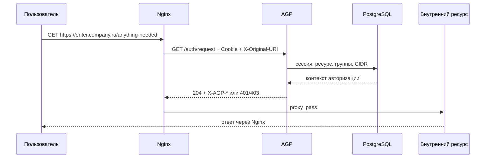

# Архитектура AGP

## Назначение

AGP - централизованный шлюз доступа к внутренним корпоративным ресурсам. Он не
заменяет приложения, а становится общей точкой аутентификации, авторизации,
аудита и публикации entry points.

## Компоненты

| Компонент | Ответственность |
| --- | --- |
| Nginx | TLS termination, reverse proxy, `auth_request`, access/error logs |
| AGP backend | login, sessions, CSRF, авторизация ресурсов, audit |
| PostgreSQL | пользователи, группы, ресурсы, сессии, аудит, downloads metadata |
| SQLite | fallback для разработки и маленьких инсталляций |
| Embedded frontend | login, пользовательский портал, админка |
| `agpctl` | bootstrap администратора и служебные команды |

## Поток Доступа К Ресурсу

## Модель Развертывания

Production baseline:

- AGP слушает `127.0.0.1:8080`;
- наружу открыт только Nginx;
- TLS завершается на Nginx;
- trusted proxy headers принимаются только от доверенных CIDR;
- PostgreSQL доступен только AGP host/network;
- Nginx bundle генерируется AGP, но применяется администратором вручную.

## Масштабирование

v1.0 рассчитан на single-node deployment. Предсказуемый путь роста:

1. вынести rate limit counters в Redis;
2. запускать несколько AGP backend instances за upstream/LB;
3. оставить server-side sessions в PostgreSQL/Redis, а не переносить все в JWT;
4. выгружать audit events в SIEM или отдельное хранилище;
5. документировать PostgreSQL HA и backup/PITR.

## Failure Scenarios

| Сбой | Поведение |
| --- | --- |
| AGP backend недоступен | Nginx не открывает защищенный ресурс, fail closed |
| PostgreSQL недоступен | login/auth_request завершаются отказом |
| Ресурс выключен | доступ запрещен |
| CIDR allowlist некорректен | доступ запрещен |
| Сессия истекла | `401`, redirect на login через Nginx |
| Неизвестный или запрещенный ресурс | единая страница `/access-denied` |

## Границы Ответственности

AGP принимает решения доступа и ведет аудит. Nginx выполняет TLS и proxying.
Внутренние приложения остаются отдельными системами и могут иметь собственную
авторизацию, но не должны считаться единственной защитой.
