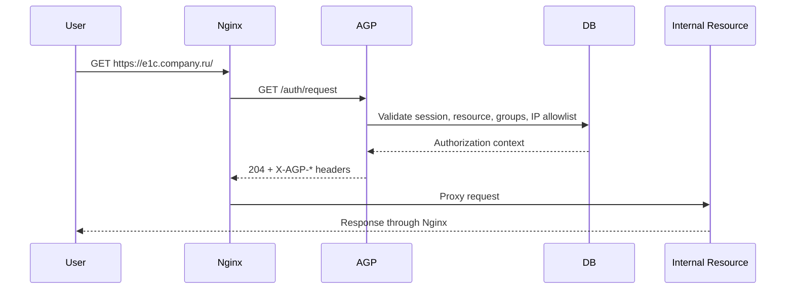

# AGP Architecture

## Назначение

AGP является централизованным шлюзом доступа к внутренним ресурсам компании.
Он не заменяет внутренние приложения, а становится контролируемой точкой
аутентификации, авторизации и аудита перед ними.

## Компоненты

| Компонент | Ответственность |
| --- | --- |
| Nginx | TLS termination, reverse proxy, `auth_request`, access/error logs |
| AGP backend | Login, sessions, resource authorization, audit events |
| PostgreSQL | Users, groups, resources, sessions, audit storage |
| SQLite | Optional development/small-install fallback |
| Embedded static frontend | Login, user portal and admin UI shell |

## Поток Данных

## Scaling Strategy

MVP is single-node by design. The clean scaling path is:

1. Move brute-force/rate-limit counters to Redis.
2. Run several backend instances behind Nginx/upstream LB.
3. Keep sessions stored server-side, not as self-contained bearer claims.
4. Export audit events to SIEM or a dedicated warehouse when retention grows.

## Failure Scenarios

| Failure | Expected behavior |
| --- | --- |
| AGP backend unavailable | Nginx denies protected resources; no fail-open mode |
| Database unavailable | Login and authorization fail closed |
| Invalid CIDR in allowlist | Resource access fails closed |
| Expired session | `401`, redirect to portal login through Nginx |
| Unauthorized or unknown resource | generic access denied UX, audited internally |

## Deployment Model

Recommended production topology:

- backend listens only on `127.0.0.1` or a private management network;
- only Nginx is Internet-facing;
- TLS is terminated at Nginx;
- AGP receives trusted proxy headers only from Nginx;
- PostgreSQL is reachable only from the AGP host/network;
- generated Nginx recommendations are reviewed and applied by administrators.
